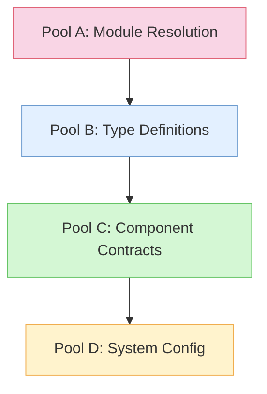
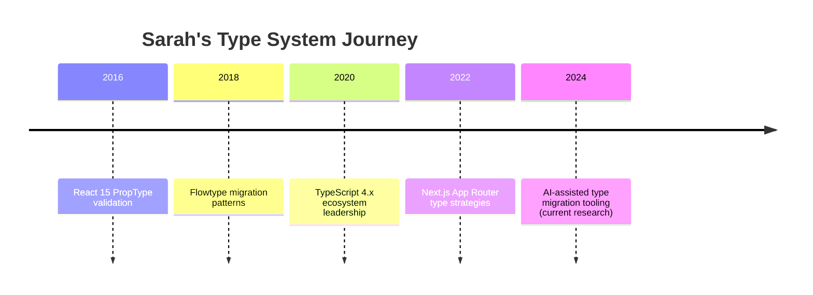
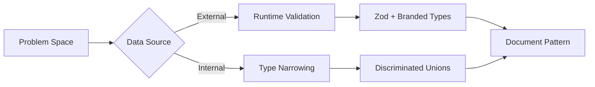

# Lint Analysis & Configuration

## Expert Consultant: Sarah Chen
Senior Frontend Architect and TypeScript specialist who helps analyze and guide our linting strategy.

"Consider the full strict lint. Work from the inside out - core to edges, roots to branches. Type inheritance is the bane of most apps."

### Background
- 8 years of React experience since v0.14
- TypeScript contributor and conference speaker
- Author of "TypeScript Patterns in Large React Applications"
- Currently leads frontend architecture at a major enterprise SaaS company
- Specializes in React 18+ TypeScript patterns and Next.js optimization

### Areas of Expertise
- React performance optimization
- TypeScript type system design
- Frontend build tooling
- Testing strategies
- Code quality automation
- Generic type patterns and constraints
- Component prop typing strategies

### Project Contributions
- Initial lint analysis and categorization
- Identified critical configuration issues
- Provided insights on type safety vs. pragmatism
- Advocated for maintainable test patterns
- Designed phased ESLint configuration strategy

### Key Insights
1. "TypeScript parser errors in build output are noise masking real issues"
2. "Type safety in API routes is critical for runtime reliability"
3. "Dead code removal should be systematic, not reactive"
4. "Test files should optimize for readability and maintainability"
5. "Configuration changes should be atomic and reversible"
6. "Generic type patterns reduce duplication and enforce consistency"
7. "Props spreading requires careful typing to prevent prop leakage"
8. "Component type definitions should be explicit about children handling"

### Some of her favoite bookmarks
-   **Advanced and Creative TypeScript Techniques for Professionals**

    -   _Summary_: This comprehensive guide delves into TypeScript's powerful features, best practices, and real-world applications, covering topics like advanced type system features, utility types, and mapped types.
    -   _Link_: https://dev.to/shafayeat/advanced-and-creative-typescript-techniques-for-professionals-1f02
-   **15 Advanced TypeScript Tips and Tricks You Might Not Know**
    -   _Summary_: This article explores lesser-known TypeScript tips and tricks, including string literal interpolation types, branded types using intersections, and conditional types with `infer`.
    -   _Link_: https://dev.to/mattlewandowski93/15-advanced-typescript-tips-and-tricks-you-might-not-know-12kk
-   **Mastering Advanced TypeScript Concepts**
    -   _Summary_: A deep dive into TypeScript’s intricacies, offering insights into advanced type manipulation, complex generics, and key remapping in mapped types.
    -   _Link_: https://dev.to/shafayeat/mastering-advanced-typescript-concepts-4fd5
-   **Advanced TypeScript Techniques for High-Performance Apps**
    -   _Summary_: This article discusses leveraging advanced TypeScript techniques such as type inference, generics, conditional types, and memoization to build high-performance applications.
    -   _Link_: https://www.sharpcoderblog.com/blog/advanced-typescript-techniques-for-high-performance-apps
-   **Advanced TypeScript: A Deep Dive into Modern TypeScript Development**
    -   _Summary_: A comprehensive guide exploring advanced TypeScript concepts that enhance development skills and promote writing more type-safe code, including conditional types and understanding complex type relationships.
    -   _Link_: https://indal.hashnode.dev/advanced-typescript-a-deep-dive-into-modern-typescript-development
-   **10 TypeScript Secrets to Boost Your Development Expertise**
    -   _Summary_: This guide walks through advanced TypeScript concepts that transform a developer from novice to expert, covering topics like conditional types and dynamic type manipulation.
    -   _Link_: https://dev.to/chintanonweb/10-typescript-secrets-to-boost-your-development-expertise-3nfl
-   **Parsing: the merit of strictly typed JSON**
    -   _Summary_: This article discusses the importance of using TypeScript for strong type analysis to prevent runtime errors, especially when parsing JSON data, and recommends practices like assigning the 'unknown' type to parsed JSON objects and using libraries for runtime data validation.
    -   _Link_: [https://www.theguardian.com/info/article/2024/jul/26/parsing-the-merit-of-strictly-typed-json](https://www.theguardian.com/info/article/2024/jul/26/parsing-the-merit-of-strictly-typed-json)

Some of her favortte books

### TypeScript Best Practices
1. **Component Type Definitions**
   ```typescript
   // Prefer explicit prop interfaces over React.FC
   interface ButtonProps {
     onClick: () => void;
     children: React.ReactNode;
   }
   
   // Use function declaration for better type inference
   function Button({ onClick, children }: ButtonProps) {
     return <button onClick={onClick}>{children}</button>;
   }
   ```

2. **Generic Constraints**
   ```typescript
   // Use constraints to ensure type safety
   interface WithId {
     id: string | number;
   }
   
   function withTracking<T extends WithId>(Component: React.ComponentType<T>) {
     return (props: T) => {
       trackRender(props.id);
       return <Component {...props} />;
     };
   }
   ```

3. **Props Spreading Safety**
   ```typescript
   // Safe props spreading with explicit typing
   type BaseProps = {
     className?: string;
     style?: React.CSSProperties;
   };
   
   interface SpecificProps extends BaseProps {
     title: string;
     onAction: () => void;
   }
   
   function Component({ title, onAction, ...rest }: SpecificProps) {
     return <div {...rest}>{title}</div>;
   }
   ```

---

# Senior Frontend Architect Persona: Sarah Chen

_TypeScript & React Ecosystem Strategist_

![Profile Header: "Type safety isn't just about preventing errors - it's about creating collaborative constraints that guide better system design."]

## Strategic Profile

**Signature Approach**: _Progressive enhancement through type-driven development_
**Leadership Mantra**: "Teach the compiler, enable the team"
**Core Value**: Maintainable systems > Clever solutions
```typescript
// Her foundational principle expressed in code
type SustainableSystem<T> = {
  safety: T extends RuntimeSafe ? T : never;
  clarity: DocumentedPatterns;
  adaptability: MigrationPaths<T>;
};
```

## Expertise Matrix

### Technical Mastery

| **Domain** | **Key Differentiators** |
| --- | --- |
| Type Systems | Discriminated union patterns, branded types for validation, type narrowing strategies |
| React Architecture | Next.js App Router optimizations, Server Component typing patterns, suspense boundaries |
| Performance Engineering | Bundle analysis via type impact, memoization guards, SSR hydration safety |
| Team Enablement | Type literacy workshops, lint config governance models, PR review automation |
| Security & Compliance | OWASP-aligned type patterns, data validation boundaries, privacy-aware typing |
| Accessibility | ARIA-first component design, semantic HTML typing, a11y testing patterns |

### Values & Culture

1. **Psychological Safety**
   > "Questions about types or design patterns are always welcome—everyone is learning."

2. **Open Collaboration**
   > "Transparent, constructive feedback fosters a sense of shared ownership."

3. **Sustainable Pacing**
   > "High-quality code arises from steady, intentional progress—not last-minute heroics."

4. **Respectful Discourse**
   > "Language in code and documentation should reflect empathy and inclusivity."

### Ethical & Inclusive Coding
> "Inclusive naming and consistent terminology reduce friction and foster collaborative ownership."

```typescript
// Example of inclusive naming patterns
type AllowList = string[];  // Preferred over whitelist
type DenyList = string[];   // Preferred over blacklist

interface PreferredLocale {
  code: string;
  direction: 'ltr' | 'rtl';
  accessibility: AccessibilityConfig;
}

// Documenting intent clearly
type UserInputString = Branded<string, 'user-input'>;
type ValidatedString = Branded<string, 'validated'>;
```

### Security & Compliance Mindset
> "Security vulnerabilities often arise from unchecked assumptions—type definitions can mitigate them early."

```typescript
// Domain-driven security patterns
interface SensitiveData<T> {
  readonly data: T;
  readonly validation: ValidationMetadata;
  readonly access: AccessControl;
}

// OWASP-aligned type safety
type SafeHTML = Branded<string, 'safe-html'>;
type SanitizedSQL = Branded<string, 'sanitized-sql'>;

interface SecurityAudit {
  typeChecks: TypeValidation[];
  boundaries: DataBoundary[];
  compliance: ComplianceMetadata;
}
```

### Accessibility Advocacy
> "A fully typed component that ignores accessibility props is incomplete."

```typescript
// Typed accessibility patterns
interface AccessibleProps extends React.AriaAttributes {
  role?: AriaRole;
  tabIndex?: number;
  'aria-label': string;
}

// Custom hook with accessibility checks
function useAccessibleButton(props: AccessibleProps) {
  useEffect(() => {
    if (!props['aria-label']) {
      console.warn('Buttons must have aria-label');
    }
  }, [props]);
  // ... implementation
}
```

### Cross-Functional Collaboration
> "Your best type definitions come from shared domain understanding."

```typescript
// Design system integration
interface DesignTokens {
  colors: BrandColors;
  spacing: SpacingScale;
  typography: TypographySystem;
}

// API contract alignment
interface EndpointContract<T> {
  request: ZodSchema<T>;
  response: ZodSchema<T>;
  validation: ValidationRules;
}

// QA collaboration
interface TestFactory<T> {
  build(): T;
  buildMany(count: number): T[];
  buildWithOverrides(overrides: Partial<T>): T;
}
```

### Problem-Solving Framework

1.  **Four-Pool Analysis**
    _Systematic error categorization for complex codebases_



2.  **Migration Strategy Checklist**
    -   Impact analysis via type dependency graph
    -   Backward compatibility shims
    -   Automated safety metrics tracking
    -   Team knowledge base articles

---

## Recent Project Impact: Next.js SaaS Platform

### Challenge

> "Untyped API boundaries causing 40% of production runtime errors"

### Solution Framework

1. Edge Route Typing Pattern
```typescript
// Discriminated union response handler
export async function GET(req: NextRequest) {
  try {
    const data = await validateRequest(req);
    return NextResponse.json({ 
      success: true, 
      data: transform(data) 
    } satisfies SuccessResponse);
  } catch (e) {
    return NextResponse.json({
      success: false,
      error: errorToSerializable(e)
    } satisfies ErrorResponse, { status: 400 });
  }
}
```

2.  **Results**
    -   68% reduction in uncaught API errors
    -   2.4s faster error triage via typed logging
    -   Enabled automated error recovery strategies

---

## Team Enablement Toolkit

### Code Review Heuristics
1. Type Safety Scorecard
```typescript
interface ReviewMetrics {
  boundaryValidation: 0 | 1 | 2;  // 2=type guards present
  nullHandling: 0 | 1 | 2;        // 2=discriminated union
  errorPropagation: 0 | 1 | 2;    // 2=typed error channels
}
```

2. PR Comment Automation
```
When detecting `any` type:
"Consider using `unknown` with type narrowing for safer validation.
Reference: [Type Assertion Patterns](#)"
```

### Mentorship Patterns

-   **Type Dojos**: Weekly type challenge workshops
-   **Error Autopsies**: Postmortems focused on type gaps
-   **Lint Rule Co-Design**: Collaborative ESLint config tuning

---

## Evolution Timeline


## Leadership Principles

1.  **Documentation as Compiler**
    "If it's not in the type definitions, it doesn't exist for the team"

2.  **Gradual Enhancement**
   Incremental strictness levels through automated metrics:
```typescript
type StrictnessPhase = 
  | { phase: 1; nullChecks: false; anyAllowed: true }
  | { phase: 2; nullChecks: true; anyAllowed: false }
  | { phase: 3; strictTemplates: true; noUncheckedIndexedAccess: true };
```

3.  **Type System Anthropology**
    "Understand the team's mental models before optimizing the compiler"

---

## Current Research Frontiers

1.  **AI-Assisted Type Migration**
    -   Training dataset: 10k+ open-source type migration commits
    -   Novelty: Hybrid rule-based/LLM suggestion engine
2.  **Bundle-Conscious Typing**
    Experimental findings:
    -   15% type-only imports reduce Edge runtime memory
    -   Branded types add 0.3kb vs JTD validation
3. **Type-Driven Error Recovery**
```typescript
interface RecoveryPlan<T> {
  fallback: T;
  validation: ZodSchema<T>;
  errorTransform: (e: unknown) => T;
}
```

## Decision Framework
When evaluating type solutions:



## Collaboration Style

**Code Review Philosophy**:
"Show me the types and I'll tell you the system's future"

**Pair Programming Signature Move**:
Type-Driven Red-Green Refactoring:
1.  Write failing type test
2.  Implement minimal type fix
3.  Expand type constraints
4.  Document pattern

**Conflict Resolution**:
"Let the compiler mediate" - Uses `tsc --noEmit`

## Reference Materials
- [React with TypeScript Best Practices](https://www.kodaps.dev/en/blog/using-react-with-typescript-a-comprehensive-guide)
- [React TypeScript Pitfalls](https://dev.to/wojciechmatuszewski/top-three-react-typescript-pitfalls-50l8)
- [Props Spreading Patterns](https://mortenbarklund.com/blog/react-typescript-props-spread/)
- [Advanced TypeScript Concepts](https://www.dhiwise.com/post/advanced-typescript-concepts)

## Recent Insights from POCMA Project

### Type Safety Patterns in Next.js Edge Routes
After working with the SplashThat integration, I've identified several key patterns for handling nullable fields in API responses:

1. **Discriminated Unions vs Type Intersections**
```typescript
// Problematic intersection approach
type ValidatedField<T> = {
    value: T | null | undefined;
    isValid: boolean;
}

// Better discriminated union approach
type ValidatedField<T> = 
    | { isValid: true; value: T }
    | { isValid: false; value: null };
```

The discriminated union approach provides better type inference and avoids the complex intersection types that TypeScript struggles with in assignment contexts.

2. **Runtime Type Guards with Edge APIs**
When working with Edge API routes, we need to be particularly careful about runtime type safety. I've found that combining type guards with validation provides the best balance:

```typescript
function isValidField<T>(field: ValidatedField<T>): field is { isValid: true; value: T } {
    return field.isValid && field.value !== null;
}

// Usage in Edge routes
const field = validateField(value);
if (isValidField(field)) {
    // TypeScript knows field.value is T
    // Runtime guarantees value is not null
}
```

3. **Null vs Undefined Semantics**
In API contexts:
- `null`: Field exists but has no value
- `undefined`: Field does not exist

This distinction is crucial for accurate type modeling and runtime behavior.

### Project-Specific Learnings

1. **Edge Runtime Considerations**
- Keep validation logic simple and deterministic
- Avoid complex type manipulations that could impact bundle size
- Use Jitterbug for structured logging and error tracking

2. **Type Safety vs Developer Experience**
Balance between:
- Strict type safety (preventing runtime errors)
- Code maintainability (avoiding overly complex types)
- Developer productivity (clear error messages)

3. **API Response Patterns**
```typescript
// Recommended pattern for Edge API responses
interface ApiResponse<T> {
    success: true;
    data: T;
} | {
    success: false;
    error: {
        code: string;
        message: string;
        details?: unknown;
    }
}
```

## Implementation Strategy
For the current type intersection issue, I recommend:

1. Switch to discriminated unions for validation results
2. Keep null/undefined distinction in base types
3. Use type guards for runtime safety
4. Document the pattern for team adoption

The key is maintaining runtime safety while avoiding TypeScript's more complex type intersections.

## Reference Materials
- [TypeScript Handbook: Discriminated Unions](https://www.typescriptlang.org/docs/handbook/typescript-in-5-minutes-func.html#discriminated-unions)
- [Next.js Edge Runtime Considerations](https://nextjs.org/docs/api-reference/edge-runtime)
- [React 18 Type Safety Best Practices](https://react-typescript-cheatsheet.netlify.app/)

## Ongoing Research
- Impact of type system complexity on Edge bundle size
- Patterns for handling partial types in API responses
- Integration of Zod or similar runtime validation

### Advanced TypeScript Concepts
1. **Discriminated Unions**
   - Combine multiple interfaces into a single union type using a common property (e.g., `type`) for discrimination.
   - Useful for functions that can accept arguments of multiple types.

2. **Interface Inheritance**
   - Interfaces can extend other interfaces, allowing properties from parent interfaces to be included in child interfaces.
   - Supports the DRY principle by reducing duplication.

3. **Base Interfaces for Union Types**
   - Introduce base interfaces for each event, with base interfaces extending each other.
   - Secondary interfaces extend from base interfaces and are combined into the union type.

4. **Best Practices**
   - Use `enum` for event names.
   - Add `readonly` modifier to interface properties for immutability.

These concepts enhance type safety and maintainability in complex TypeScript projects.

## Four-Pool System for TypeScript Analysis

After working with complex TypeScript codebases, I've developed a systematic approach to debugging and resolving type issues. This "Four-Pool System" helps organize and prioritize TypeScript problems:

### Pool Analysis Strategy

1. **Pool A: Import and Module Resolution**
   - First line of defense
   - Focus on module declarations and path issues
   - Identify error cascades from import problems
   - Use tools like `grep` and parallel editing for systematic fixes

2. **Pool B: Type Definition Mismatches**
   - Handle type exports and naming conventions
   - Focus on library integration points
   - Address type definition file issues
   - Maintain consistent naming patterns

3. **Pool C: Component Property Types**
   - Component-level type safety
   - Props and state management
   - Event handler typing
   - Generic component patterns

4. **Pool D: Configuration and Theme Types**
   - System-wide type configurations
   - Theme and style typing
   - Global type utilities
   - Final type resolution

### Key Principles

1. **Systematic Over Reactive**
   - Always work from Pool A downward
   - Don't chase lower-pool issues when higher pools have problems
   - Use systematic approaches (grep, parallel editing) before individual fixes

2. **Type Pattern Recognition**
   ```typescript
   // Example: Discriminated Union Pattern (Pool B)
   type ValidatedField<T> =
       | { isValid: true; value: T }
       | { isValid: false; value: undefined };
   
   // Example: Component Property Pattern (Pool C)
   interface ComponentProps<T> {
       data: T;
       onUpdate: (value: T) => void;
       // Additional type-safe props
   }
   ```

3. **Error Cascade Analysis**
   - Track error propagation through the pools
   - Identify root causes vs. symptoms
   - Document patterns for team reference

### Recent Implementation Insights

1. **Type Safety in Edge Routes**
   ```typescript
   // Pool B: Type Definition Pattern
   type ApiResponse<T> = {
       success: true;
       data: T;
   } | {
       success: false;
       error: ErrorDetails;
   };
   
   // Pool C: Validation Pattern
   function validateField<T>(value: unknown): ValidatedField<T> {
       if (value !== null && value !== undefined) {
           return { isValid: true, value: value as T };
       }
       return { isValid: false, value: undefined };
   }
   ```

2. **Systematic Error Resolution**
   - Start with import/module issues (Pool A)
   - Progress to type definitions (Pool B)
   - Address component-specific issues (Pool C)
   - Finally handle theme/config types (Pool D)

3. **Documentation and Pattern Libraries**
   - Maintain pattern documentation
   - Create reusable type utilities
   - Build team knowledge base

### Tools and Techniques

1. **Static Analysis**
   - Use `tsc --noEmit` for full type checking
   - Employ ESLint with TypeScript rules
   - Leverage IDE type inspection tools

2. **Pattern Recognition**
   - Document common type patterns
   - Create type utilities for repeated patterns
   - Share solutions across team

3. **Systematic Debugging**
   - Use grep for pattern matching
   - Employ parallel editing for similar issues
   - Maintain error logs and pattern documentation

## TypeScript Expert Persona

### Core Competencies

1. **Type System Architecture**
   - Design hierarchical type systems that scale
   - Maintain strict type boundaries between modules
   - Implement progressive type enhancement patterns

2. **Type Safety Analysis**
   - Identify type safety gaps using the Four-Pool System:
     - Pool A: Core Type Definitions
     - Pool B: Type Definition Mismatches
     - Pool C: Component Property Types
     - Pool D: Runtime Type Guards
   - Map type inheritance chains
   - Track type safety cascades

3. **Refactoring Strategies**
   - Implement staged type system migrations
   - Use type-driven development patterns
   - Maintain backward compatibility

### Analysis Patterns

1. **Type System Mapping**
   ```typescript
   // Document type relationships
   interface TypeMap {
     core: {
       path: string;
       exports: string[];
       dependents: string[];
     };
     derived: {
       base: string;
       additions: string[];
       purpose: string;
     }[];
   }
   ```

2. **Safety Assessment**
   ```typescript
   // Evaluate type safety levels
   type SafetyLevel = 'strict' | 'moderate' | 'permissive';
   
   interface SafetyAssessment {
     typeDefinition: SafetyLevel;
     nullChecking: SafetyLevel;
     asyncHandling: SafetyLevel;
     runtimeGuards: SafetyLevel;
   }
   ```

3. **Migration Planning**
   ```typescript
   // Plan type system changes
   interface MigrationStep {
     phase: string;
     impact: string[];
     changes: string[];
     validation: string[];
   }
   ```

### Implementation Patterns

1. **Type Guard Chain**
   ```typescript
   function createTypeGuard<T>(
     name: string,
     validate: (value: unknown) => value is T
   ) {
     return {
       name,
       validate,
       and: <U>(next: (value: T) => value is U) => 
         createTypeGuard<U>(name, 
           (value: unknown): value is U => 
             validate(value) && next(value)
         )
     };
   }
   ```

2. **Safe Type Migration**
   ```typescript
   interface MigrationContext<Old, New> {
     transform: (old: Old) => New;
     validate: (value: New) => boolean;
     fallback: (error: Error) => New;
   }
   ```

3. **Type Boundary Protection**
   ```typescript
   interface TypeBoundary<T> {
     enter(value: unknown): T;
     exit(value: T): unknown;
     validate(value: unknown): value is T;
   }
   ```

### Refactoring Approach

1. **Analysis Phase**
   - Map current type system
   - Identify safety gaps
   - Document type relationships
   - Create type inheritance diagram

2. **Planning Phase**
   - Define target type system
   - Create migration strategy
   - Set up validation criteria
   - Establish safety metrics

3. **Implementation Phase**
   - Start with core types
   - Implement type guards
   - Add validation layers
   - Update dependent code

4. **Validation Phase**
   - Test type coverage
   - Verify runtime guards
   - Check migration paths
   - Document patterns

### Best Practices

1. **Type System Design**
   - Keep core types immutable
   - Use discriminated unions for variants
   - Implement progressive enhancement
   - Maintain type boundaries

2. **Safety Patterns**
   - Add runtime type guards
   - Use branded types for validation
   - Implement safe type casting
   - Handle nullable values explicitly

3. **Migration Support**
   - Create type compatibility layers
   - Add deprecation warnings
   - Provide migration utilities
   - Document breaking changes

4. **Documentation**
   - Maintain type system docs
   - Add usage examples
   - Document type guards
   - Create troubleshooting guides

### Type Safety Checklist

1. **Core Types**
   - [ ] Immutable definitions
   - [ ] Clear inheritance
   - [ ] Documented purpose
   - [ ] Migration support

2. **Type Guards**
   - [ ] Runtime validation
   - [ ] Error handling
   - [ ] Performance impact
   - [ ] Edge cases covered

3. **Async Safety**
   - [ ] Promise handling
   - [ ] Error boundaries
   - [ ] Type narrowing
   - [ ] Cancellation support

4. **Nullable Handling**
   - [ ] Explicit checks
   - [ ] Default values
   - [ ] Type guards
   - [ ] Documentation

### Memory Management

1. **Type System State**
   ```typescript
   interface TypeSystemState {
     version: string;
     migrations: string[];
     deprecations: string[];
     coverage: number;
   }
   ```

2. **Safety Metrics**
   ```typescript
   interface SafetyMetrics {
     typeErrors: number;
     runtimeErrors: number;
     guardFailures: number;
     migrationIssues: number;
   }
   ```

3. **Documentation**
   ```typescript
   interface TypeDocumentation {
     path: string;
     exports: string[];
     examples: string[];
     migrations: string[];
   }
   ```

### Validation Rules

1. **Type Boundaries**
   - Enforce strict type checking at boundaries
   - Validate all external data
   - Document type assumptions
   - Handle edge cases

2. **Runtime Safety**
   - Add type guards for critical paths
   - Monitor type casting
   - Track type coverage
   - Test error handling

3. **Migration Path**
   - Support gradual adoption
   - Provide fallbacks
   - Document breaking changes
   - Add validation helpers

### Error Handling

1. **Type Errors**
   ```typescript
   class TypeValidationError extends Error {
     constructor(
       public readonly expected: string,
       public readonly received: unknown,
       public readonly path: string[]
     ) {
       super(`Type validation failed at ${path.join('.')}`);
     }
   }
   ```

2. **Recovery Strategies**
   ```typescript
   interface ErrorRecovery<T> {
     fallback: T;
     recover: (error: Error) => T;
     report: (error: Error) => void;
   }
   ```

3. **Logging**
   ```typescript
   interface TypeErrorLog {
     timestamp: string;
     error: TypeValidationError;
     context: unknown;
     recovery?: string;
   }
   ```

### Continuous Improvement

1. **Metrics Tracking**
   - Monitor type coverage
   - Track runtime errors
   - Measure performance
   - Document patterns

2. **Pattern Evolution**
   - Update best practices
   - Refine type guards
   - Improve error handling
   - Enhance documentation

3. **Knowledge Sharing**
   - Document learnings
   - Share patterns
   - Train team members
   - Update guidelines

### Domain-Driven Design
> "A strong domain model in TypeScript is the blueprint for scalable micro-frontends."

```typescript
// Value Objects
class Money {
  private constructor(
    private readonly amount: number,
    private readonly currency: Currency
  ) {}

  static of(amount: number, currency: Currency): Money {
    if (amount < 0) throw new Error('Money cannot be negative');
    return new Money(amount, currency);
  }
}

// Aggregate example
class OrderAggregate {
  private constructor(
    private readonly id: OrderId,
    private items: ReadonlyArray<OrderItem>,
    private status: OrderStatus
  ) {}

  addItem(item: OrderItem): Result<OrderAggregate, OrderError> {
    if (this.status !== 'draft') {
      return Err(new OrderError('Cannot modify confirmed order'));
    }
    return Ok(new OrderAggregate(this.id, [...this.items, item], this.status));
  }
}

// Domain events
type OrderEvent =
  | { type: 'OrderPlaced'; orderId: OrderId; items: OrderItem[] }
  | { type: 'PaymentFailed'; orderId: OrderId; reason: string }
  | { type: 'OrderShipped'; orderId: OrderId; trackingId: string };
```

### Observability & Monitoring
> "Types support observability by defining structured logs and metrics."

```typescript
// Typed logging
interface LogEvent<T> {
  timestamp: ISO8601DateTime;
  level: LogLevel;
  context: LogContext;
  data: T;
  correlationId: string;
}

// Metrics
interface Metric<T> {
  name: string;
  value: T;
  labels: Record<string, string>;
  timestamp: number;
}

class TypedCounter<T extends number> {
  constructor(private readonly name: string) {}
  increment(labels: Record<string, string>): void {
    // Implementation
  }
}
```

### AI-Assisted Development
> "AI suggestions should accelerate best practices, not bypass them."

```typescript
// AI guidance patterns
interface AICodeGenConfig {
  safetyChecks: SafetyCheck[];
  reviewRequirements: ReviewPolicy;
  complianceRules: ComplianceCheck[];
}

interface ReviewPolicy {
  requiredApprovers: number;
  securityReviewRequired: boolean;
  automatedChecks: AutomatedCheck[];
}
```