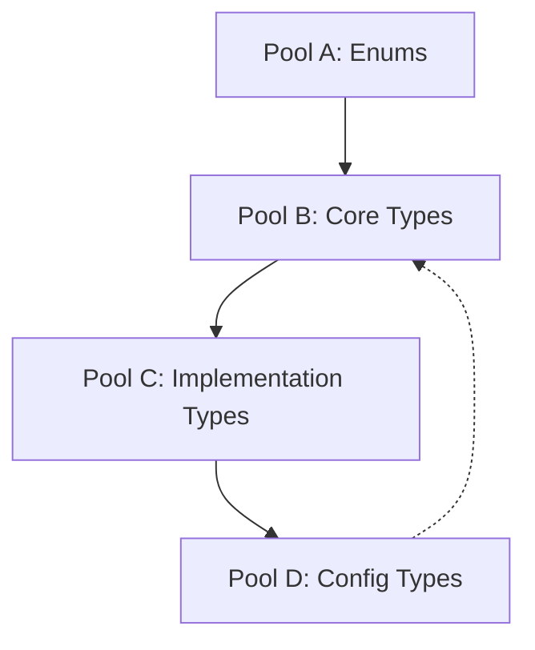

# Type System Analysis

## Current State Analysis

### Pool A: Core Type Definitions
- Location: `src/types/enums.ts`
- Purpose: Foundational constants and literal types
- Current Issues:
  - Duplicate definitions between files
  - Inconsistent export patterns
```typescript
// Core Constants (Pool A)
const LogLevels = {
    DEBUG: "DEBUG",
    INFO: "INFO",
    WARN: "WARN",
    ERROR: "ERROR",
    FATAL: "FATAL"
} as const;

type LogLevel = keyof typeof LogLevels | Lowercase<keyof typeof LogLevels>;
```

### Pool B: Interface Definitions
- Location: `src/types/types.ts`
- Purpose: Core interfaces and type definitions
- Current Issues:
  - Inconsistent index signatures
  - Type mismatches in LogEntry
```typescript
// Core Interfaces (Pool B)
interface LogContext {
    timestamp: string;
    runtime: RuntimeType;
    environment: EnvironmentType;
    namespace: string;
    [key: string]: unknown; // Missing in some definitions
}

interface LogEntry<T = Record<string, unknown>> {
    level: LogLevel;
    message: string;
    data?: T;
    error?: Error;
    context: LogContext;
    warnings?: string[]; // Inconsistent presence
}
```

### Pool C: Implementation Types
- Location: `src/transports/types.ts`, `src/processors/types.ts`
- Purpose: Implementation-specific interfaces
- Current Issues:
  - Type conflicts with core definitions
  - Inconsistent import paths
```typescript
// Implementation Types (Pool C)
interface LogProcessor {
    process<T>(entry: LogEntry<T>): Promise<LogEntry<T>>;
    supports(runtime: RuntimeType): boolean;
    allowedIn(environment: EnvironmentType): boolean;
}

interface LogTransport {
    write<T>(entry: LogEntry<T>): Promise<void>;
}
```

### Pool D: Configuration & Factory Types
- Location: `src/types.ts`
- Purpose: High-level configuration and factory types
- Current Issues:
  - Duplicate definitions
  - Inconsistent type references
```typescript
// Configuration Types (Pool D)
interface JitterbugConfig {
    namespace: string;
    enabled?: boolean;
    level?: LogLevel;
    runtime?: RuntimeType;
    environment?: EnvironmentType;
    processors?: LogProcessor[];
    transports?: LogTransport[];
}
```

## Type Flow Analysis

### Current Flow


### Problem Areas
1. **Circular Dependencies**
   - Config types referencing core types
   - Implementation types referencing multiple versions

2. **Type Duplication**
   - Multiple definitions of LogLevel
   - Inconsistent LogContext interfaces

3. **Import Path Issues**
   - Some files import from /types
   - Others from /types/types.js
   - Mixed usage of .js extensions

## Resolution Strategy

### 1. Consolidate Core Types (Pool A)
```typescript
// src/types/core.ts
export const LogLevels = {...} as const;
export type LogLevel = keyof typeof LogLevels;
```

### 2. Standardize Interfaces (Pool B)
```typescript
// src/types/interfaces.ts
export interface LogContext {
    timestamp: string;
    runtime: RuntimeType;
    environment: EnvironmentType;
    namespace: string;
    [key: string]: unknown;
}
```

### 3. Unify Implementation Types (Pool C)
```typescript
// src/types/implementations.ts
export interface LogProcessor {
    process<T>(entry: LogEntry<T>): Promise<LogEntry<T>>;
    // ...
}
```

### 4. Centralize Configuration (Pool D)
```typescript
// src/types/config.ts
export interface JitterbugConfig {
    namespace: string;
    // ...
}
```

## Implementation Plan

1. **Phase 1: Core Consolidation**
   - Move all enums to `src/types/enums.ts`
   - Remove duplicate definitions
   - Standardize export patterns

2. **Phase 2: Interface Standardization**
   - Add index signature to LogContext
   - Standardize LogEntry interface
   - Update all implementations

3. **Phase 3: Import Path Resolution**
   - Update all imports to use `/types`
   - Remove .js extensions
   - Fix circular dependencies

4. **Phase 4: Type Validation**
   - Add type tests
   - Verify type compatibility
   - Document type boundaries

## Type Boundaries

### Core → Implementation
```typescript
// Enforce strict boundaries
type CoreLogEntry = Readonly<LogEntry>;
type TransportLogEntry = LogEntry & { warnings?: string[] };
```

### Implementation → Configuration
```typescript
// Ensure type safety in config
type SafeConfig = Readonly<JitterbugConfig>;
type RuntimeConfig = Partial<JitterbugConfig>;
``` 